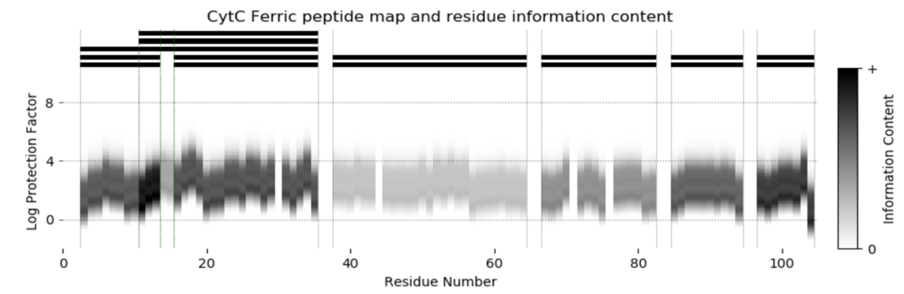
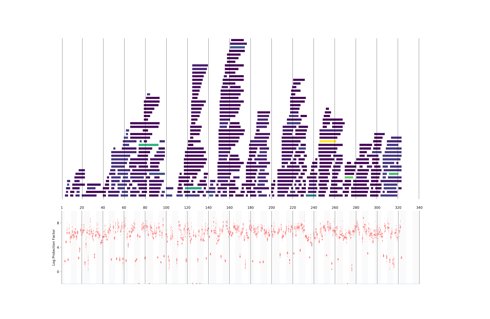
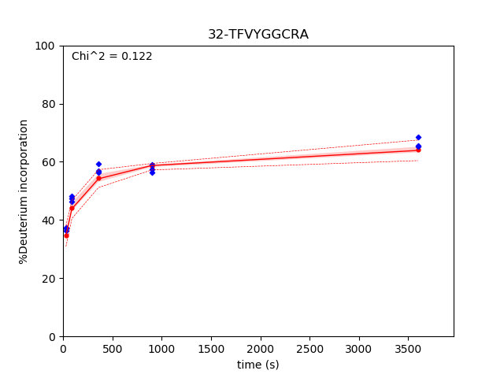

[](https://travis-ci.org/salilab/bayesian_hdx)
[](https://codecov.io/gh/salilab/bayesian_hdx)

# bayesian_hdx
Bayesian Analysis of HDX-MS Data. 

## Version 2.1

Estimate the residue-resolved amide hydrogen protection factors for a protein given an MS-HDX dataset and other information.

### Requirements
* python 2.7 or 3.X
* numpy
* scikit-learn
* scipy
* matplotlib


Inputs: 
* [HDX-MS dataset(s)]
* [Prior parameters]
* [Sampling parameters]

Outputs:
* [Input information visuals]
* [Sampling convergence plots]
* [Protection factor distributions]
* [Pymol scripts for visualizing Pfs]

Other analyses
* [dHDX - magnitude and significance of HDX difference between two states]


## tl/dr Usage

### As python script
The method runs as a python scripts that can be modified by the user.  To start immediately, go to `examples/CytC` and run:
```
python run_lots_of_cytc.py 1 test
```
Read through  and below to see how to incorporate your data and information into the modeling.


### From the command line with a HDXWorkbench file
Alternatively, if you have an HDX Workbench file, you can input it directly to the `workbench_executable.py` script with the following format:
```
python workbench_executable.py "path/to/workbench/file.csv" "output_directory"
```
Additional command line arguments can be added. Run `python workbench_executable.py -h` to see all options.  Ensure that the ./pyext/src/ folder is in your PYTHONPATH or add it at invocation with the flag `--path "path/to/code/pyext/src"`.


## Methodology and more complete instructions

### Overview
Protection factor modeling is performed by convering [HDX-MS timepoint data] into a scoring function that can be evaluated against a proposed set of protection factors for each residue. Thousands to millions of protection factor combinations are evaluated using Markov chain Monte-Carlo. The best fitting sets of protection factor values are reported as an ensemble, allowing interpretation of not only the magnitude of the protection factor, but the precision of it as well. 

The method proceeds in five steps:

1) Gather Input Data and Information
2) Define Scoring Function and Representation
3) Sample Alternative Configurations
4) Ensure Sampling Exhaustiveness
5) Analyze Results

## 1) Gathering Input Data

HDX-MS data can read from a number of HDX file formats including HDXWorkbench, MSStudio and Waters using macros found in pyext/src/hxio.py.

```
apo_data_pH7.5 = hxio.import_waters(waters_datafile, sequence)
```

Data can also be read from a .csv file with the following format:
```
# peptide_seq, start_res, time, D_inc, Score [optional] 
AAMNST, 1, 10, 3.212346
AAMNST, 1, 30, 8.5279405
AAMNST, 1, 90, 20.9023379
```
using the following command
```
data_conditions = data.Conditions(pH=7.5, temperature=298, saturation=0.7)
apo_data_pH7.5 = hxio.import_HXColumns(input_file, sequence, percentD=False, conditions=data_conditions, error_estimate=5.0)
```
Data must also include a set of Conditions, which defines the pH, temperature and estimated deuterium recovery fraction (if not using fully-deuterated controls).

Currently, the "Score" column is not used, but will be in upcoming versions

## 2) Define Scoring Function and Representation

#### Defining the system representation

The system is defined as a single macromolecule via its FASTA sequence. 

```
# Initialize model
sys = system.System(output_dir=outputdir, noclobber=False)
mol = sys.add_macromolecule("MYFAVRITEPEPTIDE", name="Molecule", initialize_apo=False)
```
Individual states can be added to the system. These might represent different liganded states, different buffer conditions or point mutations.

States can be added to each molecule. Each state may have multiple `data.Datasets` objects associated with it.
```
apo_state = mol.add_state(name="Apo")
apo_state.add_dataset(apo_data_pH7.5)
apo_state.add_dataset(apo_data_pH7.0)

lig1_state = mol.add_state(name="ligand1")
lig1_state.add_dataset(ligand1_data)
```

Point mutations must be explicitly defined as a perturbation so intrinsic exchange values can be modified
```
E11A_state = mol.add_state(name="E11A", perturbations=[("mutation", "E11A")])
E11A_state.add_dataset(E11A_data)
```

There is a single choice for representing protein protection factors: `model.ResidueGridModel`. This representation creates a single parameter for each residue, the log(protection factor), and allows it to sample discrete values along a grid. The value of log(protection factor) is bounded by -2 and 14, with the grid_size defined by the user. A value of 50-100 has been found to be sufficient in most cases. The model can be defined to sample only residues observed in the datasets. 
```
model_representation = model.ResidueGridModel(state, grid_size=100, sample_only_observed_residues=False)

apo_state.set_output_model(model_representation)
```

### Check the data information content of your system

Before running a simulation, you can check the relative information content of your data at each protection factor. Dark values indicate protection factor ranges that are well sampled by the set of peptide timepoints. 

```
protection_factors = numpy.arange(-2,14,0.1)
for s in mol.get_states():
    plots.plot_overlap_and_information(s, protection_factors, outfile="./"+s.get_name()+"_data-info.png", figwidth_scale=2.0)
```



#### Set the Scoring Function

The Forward Model combined with a Noise Model defines how a proposed set of protection factors will be evaluated against the data. Currently, there is only choice, scoring.GaussianNoiseModel. Given a set of protection factors for all residues, the point estimate for the deuterium incorporation for each peptide and timepoint is calculated [Eqn. 1, the forward model]. It is scored against each observed deuterium incorporation via a Gaussian function [Eqn. 2, the noise model], where sigma is the estimated error in the experimental value; this quantity can be sampled.

[Pictures with math]


### Adding Priors
Prior probability distributions are valuable for explicitly incorporating other information into our simulations.  Currently, we have two prior types, ResiduePfPrior and NaturalAbundancePrior.

#### Individual residue prior
Used to restrain the value of the protection factor, useful for incorporating estimates from MD simulation or NMR data. Can be formulated as a Gaussian or empirical prior. Default = None. 

#### NaturalAbundancePrior
A prior to represent the distribution of expected protection factors found in globular proteins. The default prior is an empirical function based on a survey of HDX experts (read: we made up a curve that looks reasonable). 


## 3) Sampling

A single Markov chain can be initiated. Several sampling parameters can be adjusted for the expert user to optimize mixing and obtain the desired acceptance ratios:

* `pct_moves` - The percentage of residue protection factors that are moved each MC step (default=50.
* `adjacency` - The maximum step size (in grid points) for a single MC move (default = 0.2 * grid_size for annealing, 0.1*grid_size for production)
* `steps` - Number of MC steps

Percent_moves defines the number of residues that are perturbed for each MC step (0-100) during production runs.

```
sampler = sampling.MCSampler(sys, pct_moves=20)
```

The sampling scheme can be manually set.  Extensive empirical testing has found a reasonable process that includes a number of simulated anneals followed by exponential temperature decay.

```
annealing_steps = 50 # number of temperature steps (20-50 seems adequate)
steps_per_anneal = 10 # number of MC steps per temerature (5-10)
nsteps = 2000 # Number of burn in steps and number of production steps
Ns = 5 #  Number of simulated annealings to run. Only limited by your processor speed and patience!

# Run a few simulated annealing steps.
for i in range(Ns): 
    sampler.pct_moves = 100
    # Do an exponential temperature decay annealing from T=100 to T=2
    sampler.run_exponential_temperature_decay(tmax=100.0, tmin=2.0, 
                                        annealing_steps=annealing_steps, 
                                        steps_per_anneal=steps_per_anneal,
                                        write=False,
                                        adjacency=0.2*num_exp_bins)


    # Set the adjacency to be smaller now for equilibrium sampling
    sampler.residue_sampler.set_adjacency(True, adjacency=0.2*num_exp_bins)

    sampler.pct_moves = 50
    # Run burn-in steps. Do not write these models out.
    sampler.run(nsteps,2.0, write=False)

    # Run equilibrium simulations and write these to the output file
    sampler.run(nsteps,2.0, write=True)
```

It is recommended to run at least four individual Markov chains.

### 4) Samping Evaluation

Sampling convergence is estimated by comparing the variation of a parameter (residue Pf value) within a single chain, to the variation over all chains (Rhat). This value is recorded for each residue:

[Residue rhat plot]

Values < 1.05 suggest convergence. Values greater than 1.1 are indicative of incomplete sampling. You can [restart] the Markov chains and add more samples.

Sampling precision refers to the resolution at which independent samples are equal. This is measured in log(protection factor) units using procedures developed in [Viswanath et. al.].


## 5) Analyze Results
Data output is delivered in into the `output` (or user-defined) directory. 

A number of plots are produced to show the results of simulation:

* HDX Model Plots - Plots the ensemble of calculated HDX protection factors at each residue as violin plots (bottom) and color coded the peptide map on top via the chi^2 fit. Bright colors = large chi values. 



* Peptide fit-to-data - Plots of time vs. %D incorporation showing the fit of the model to the data. Experimental observations are blue dots. Model 2D incorporations are plotted with line. The 25th-75th percentiles are shaded red and max and min 2D values are dashed lines.



Poor-fitting peptides may be a result of insufficient sampling, incoherent data and/or peptide misassignments. 

### dHDX difference between states
The ensembles produced by the Bayesian HDX method are particularly useful for identifying differences in HDX between two states of a macromolecule


## Version Notes

----------------------
## Version 2.1 Updates
Version 2.1 represents a major upgrade in analysis tools, scoring functions and front-end interaction.

### Notable changes/additions
* Plots for visualizing data information content and prior probability distributions for each protection factor.
* Plots for estimating sampling convergence at the residue-level
* Updated plots for visualizing model-data parsimony
* Simpler front-end scripts
----------------------


----------------------
## Version 2.0 changes
The major change in V2.0 is the explicit calculation of protection factors for each residue, rather than the difference between two states. Estimations of the magnitude and significance of difference, the focus of v1.0, is essentially unchanged, however, I do see some small, but insignificant numerical differences between the two methods. 

The documentation for the v2.0 workflow is found in the v2 directory.  Eventually, v1 will be deprecated.  

### Notable changes/additions
* 2-10 fold increase in speed
* Calculation of intrinsic unfolded exchange rates based on Bai, Englander 1993.
* Consolidated output file to allow restarting of modeling runs
* Bug fixes
----------------------
